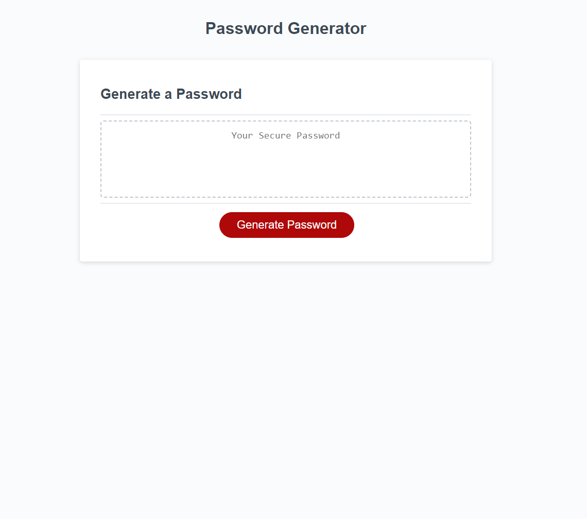

## Table of contents
​
- [Overview](#overview)
  - [The challenge](#the-challenge)
  - [Screenshot](#screenshot)
  - [Links](#links)
- [My process](#my-process)
  - [Built with](#built-with)
  - [What I learned](#what-i-learned)
  - [Continued development](#continued-development)
  - [Useful resources](#useful-resources)
- [Author](#author)
- [Acknowledgments](#acknowledgments)
​

## Overview
​
### The challenge
​
Users should be able to:
​
- AS AN employee with access to sensitive data
- I WANT to randomly generate a password that meets certain criteria
- SO THAT I can create a strong password that provides greater security

Acceptance Criteria

- GIVEN I need a new, secure password
- WHEN I click the button to generate a password
- THEN I am presented with a series of prompts for password criteria
- WHEN prompted for password criteria
- THEN I select which criteria to include in the password
- WHEN prompted for the length of the password
- THEN I choose a length of at least 8 characters and no more than 128 characters
- WHEN asked for character types to include in the password
- THEN I confirm whether or not to include lowercase, uppercase, numeric, and/or special characters
- WHEN I answer each prompt
- THEN my input should be validated and at least one character type should be selected
- WHEN all prompts are answered
- THEN a password is generated that matches the selected criteria
- WHEN the password is generated
- THEN the password is either displayed in an alert or written to the page

​
### Screenshot
​

​

### Links
​
- Solution URL: [https://github.com/AveryCaldwell/password-Generator-JS](https://github.com/AveryCaldwell/password-Generator-JS)
- Live Site URL: [https://averycaldwell.github.io/password-Generator-JS/](https://averycaldwell.github.io/password-Generator-JS/)
​
## My process
​
### Built with
​
- Semantic HTML5 markup
- CSS custom properties
- JavaScript
- Git/Git pages
​
​​
### What I learned
​
- While working on this project, I learned how to store multiple arrays within an object under a single variable name to make it easier to read and more efficient for info retrieval.
- In regard to spread syntex, I do not currently understand it & need to revisit. It removes dupplicate entries from the array.
- This is the first time I have used `Math.floor()` and is was used to get random value from an array.
To see how you can add code snippets, see below:


```js
var charObj = {
  1: [
    "a",
    "b",
    "c",
    "d",
    "e",
    "f",
    "g",
    "h",
    "i",
    "j",
    "k",
    "l",
    "m",
    "n",
    "o",
    "p",
    "q",
    "r",
    "s",
    "t",
    "u",
    "v",
    "w",
    "x",
    "y",
    "z",
  ],
  2: [
    "A",
    "B",
    "C",
    "D",
    "E",
    "F",
    "G",
    "H",
    "I",
    "J",
    "K",
    "L",
    "M",
    "N",
    "O",
    "P",
    "Q",
    "R",
    "S",
    "T",
    "U",
    "V",
    "W",
    "X",
    "Y",
    "Z",
  ],
  3: ["0", "1", "2", "3", "4", "5", "6", "7", "8", "9"],
  4: ["!", "%", "&", ",", "*", "+", "-", ".", "/", "<", ">", "?", "~"],
};

```

```js
  var charTypeArray = charType.split(",");
  var uniqArray = [...new Set(charTypeArray)];
  charTypeArray = uniqArray;
  if (charType.indexOf(" ") !== -1) {
    alert("Invalid character type input. Please try again.");
    charTypeArray = false;
    return charTypeArray;
  }
```
​
```js
function passwordGenerator(passLength, charTypeArray) {
  var randomType, randomChar;
  var passwordStr = "";
  for (i = 0; i < passLength; i++) {
    randomType =
      charTypeArray[Math.floor(Math.random() * charTypeArray.length)];
    randomChar =
      charObj[randomType][
        Math.floor(Math.random() * charObj[randomType].length)
      ];
    passwordStr = passwordStr + randomChar;
  }
  return passwordStr;
}
```
​
### Continued development
​
​I want to further my understanding of `Math.random()` because it is a useful tool for random generation. I would also like to better understand the `Set object` because of the multiple useful methods and ability to store unique values.
​
​
### Useful resources
​
- [https://developer.mozilla.org/en-US/docs/Web/API/EventTarget/addEventListener](https://developer.mozilla.org/en-US/docs/Web/API/EventTarget/addEventListener) - This helped me for understanding the `addEvent:Listener() method`. I really liked how different parameters were defined.
- [https://www.w3schools.com/js/js_object_sets.asp](https://www.w3schools.com/js/js_object_sets.asp) - This is a great explanation of Javascript Sets. The site provides examples and even allows the user to "Try it Yourself".
​


## Author
Avery Caldwell
- GitHub - [AveryCaldwell](https://github.com/AveryCaldwell)
​
​
## Acknowledgments
​
I found information on [Stack Overflow](https://stackoverflow.com/) for creating a unique array. It utilized set function and spread notation. 

​

